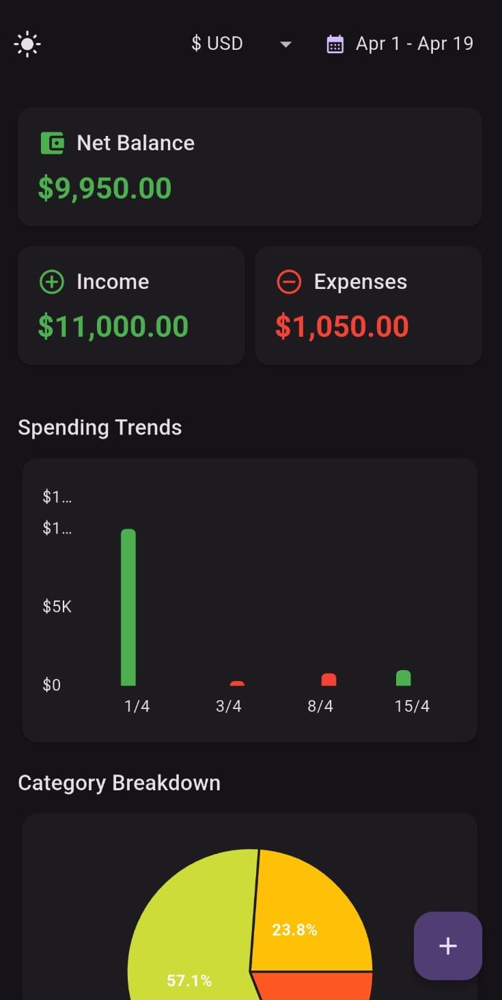
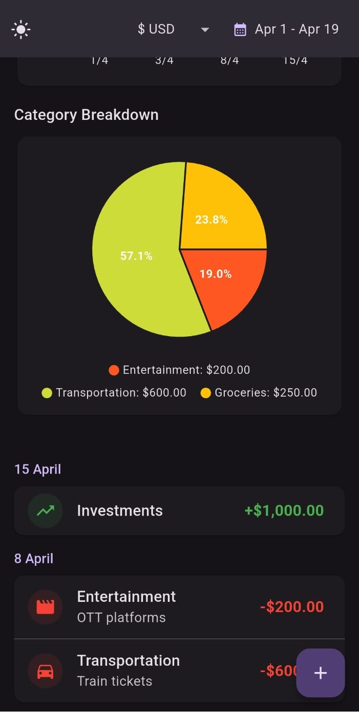
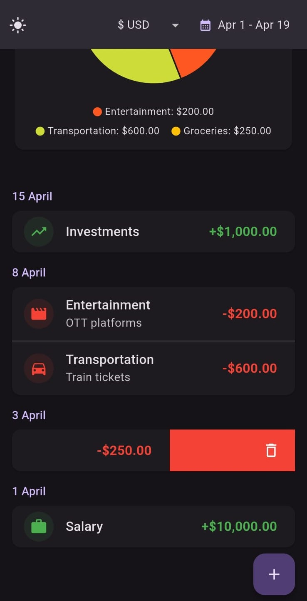
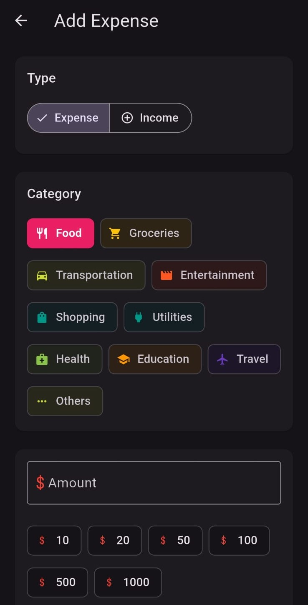

# Expensive - Smart Expense Tracker



A powerful and intuitive expense tracking app that helps you take control of your finances. Built with Flutter for a beautiful, native experience.

## Features

### 📊 Expense Analytics
Visualize your spending patterns with beautiful charts and graphs.

### 🏷️ Smart Categories
Automatically categorize your expenses for better organization.

### 🔔 Budget Alerts
Get notified when you're approaching your budget limits.

### ☁️ Cloud Sync
Access your data from anywhere, anytime.

## Screenshots

|  |  |
|:---:|:---:|
| *Main Dashboard* | *Expense List* |

|  |  |
|:---:|:---:|
| *Delete Expenses* | *Detailed View* |

## Download

[](https://github.com/ayushmd/expensive/releases/latest/download/app-release.apk)

> iOS version coming soon!

## Getting Started

1. Download the latest APK from the [releases page](https://github.com/ayushmd/expensive/releases)
2. Install on your Android device
3. Start tracking your expenses!

## Development

This project is built with Flutter. To contribute:

```bash
# Clone the repository
git clone https://github.com/ayushmd/expensive.git

# Install dependencies
flutter pub get

# Run the app
flutter run
```

## Contributing

Contributions are welcome! Please feel free to submit a Pull Request.

## Contact

- GitHub: [@ayushmd](https://github.com/ayushmd)
- Email: [ayushmdcr@gmail.com](mailto:ayushmdcr@gmail.com)

## License

This project is licensed under the MIT License - see the [LICENSE](LICENSE) file for details.

---

> **Note**: This application was developed with the assistance of AI tools.


